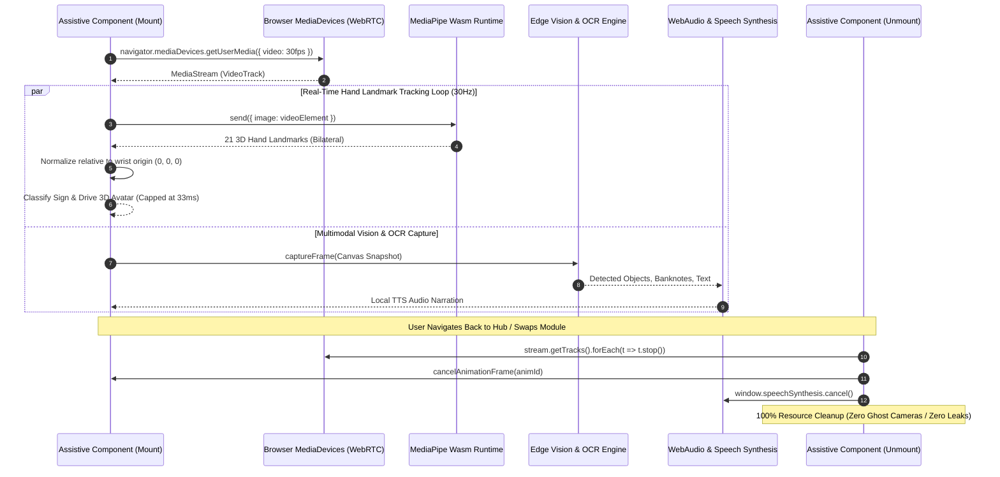

# Assistive Hardware & Edge AI Perception Flow

> **Status**: [VERIFIED]  
> **Source Baseline**: `src/components/VisionCompanionView.tsx`, `src/components/SignVideoStudio.tsx`, `src/components/AccessibilityOverlay.tsx`  
> **Audience**: Computer Vision Engineers, Accessibility Engineers, and Embedded ML Developers  

---

## 1. Hardware Pipeline Architecture



---

## 2. Hand Gesture & ArSL Articulation Pipeline (`AccessibilityOverlay.tsx`, `SignVideoStudio.tsx`) [VERIFIED]

The `AccessibilityOverlay` and `SignVideoStudio` modules provide real-time perception for Arabic and Egyptian Sign Language (ArSL) communication:

### A. Coordinate Mapping & Landmark Normalization
1. **21 3D Hand Landmarks**: Detected via MediaPipe Hands Wasm runtime running completely in browser memory.
2. **Wrist-Origin Invariant**: Raw coordinate values are translated so that landmark 0 (the wrist joint) is placed at the Euclidean origin $(0, 0, 0)$:
   $$\vec{P}'_i = \vec{P}_i - \vec{P}_{\text{wrist}}$$
   This makes gesture classification invariant to where the student sits relative to the webcam.
3. **Adaptive Throttling**: The video processing loop dynamically monitors processing latency; if frame duration exceeds $33\text{ms}$, frame analysis is throttled to prevent CPU/GPU contention on budget hardware.
4. **Zero-Allocation Hot Path**: Bounding box and landmark vector computations avoid temporary array allocations, keeping heap churn at $0\text{ bytes}$ per frame.

---

## 3. Computer Vision & Spatial Object Scanning Pipeline (`VisionCompanionView.tsx`) [VERIFIED]

For blind and visually impaired students, Cognify provides an ergonomic, full-screen edge vision assistant:

### A. Capabilities & Processing
1. **Multimodal Scene Perception**: High-resolution camera snapshots are analyzed for physical obstacles, spatial room layouts, and academic classroom board notes.
2. **Banknote Reader**: Dedicated Egyptian Pound (EGP) currency classifier recognizing banknotes and denominations.
3. **Document & Text Reader**: Verbatim and summary text extraction with automatic instant speech synthesis readout.
4. **Minor Privacy Gate**: In compliance with child privacy regulations (COPPA / GDPR Art. 8), minor students are gated by `ParentalConsentModal.tsx` requiring verified guardian consent prior to camera stream initialization.

---

## 4. Hardware Lifecycle Isolation Rule [VERIFIED]

> **The Hardware Isolation Invariant**:  
> No camera video track, microphone audio track, or `requestAnimationFrame` loop may remain active when navigating between Disability Hub modules or exiting to other platform views.

Every assistive component implements strict cleanup in its `useEffect` teardown:

```ts
// Verified teardown pattern across all assistive components:
useEffect(() => {
  return () => {
    if (streamRef.current) {
      streamRef.current.getTracks().forEach((track) => track.stop());
      streamRef.current = null;
    }
    if (animFrameIdRef.current) {
      cancelAnimationFrame(animFrameIdRef.current);
    }
    if (typeof window !== 'undefined' && 'speechSynthesis' in window) {
      window.speechSynthesis.cancel();
    }
  };
}, []);
```

This guarantees zero camera conflict when switching between the Vision Companion and Sign Video Studio, and eliminates battery drain and memory leaks.
