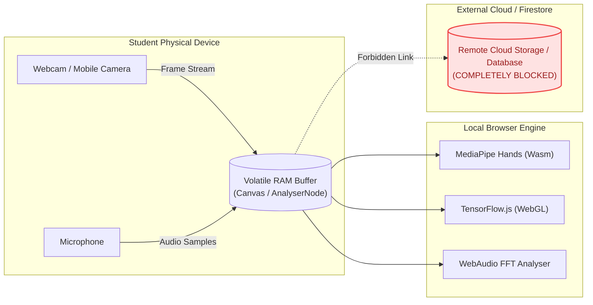
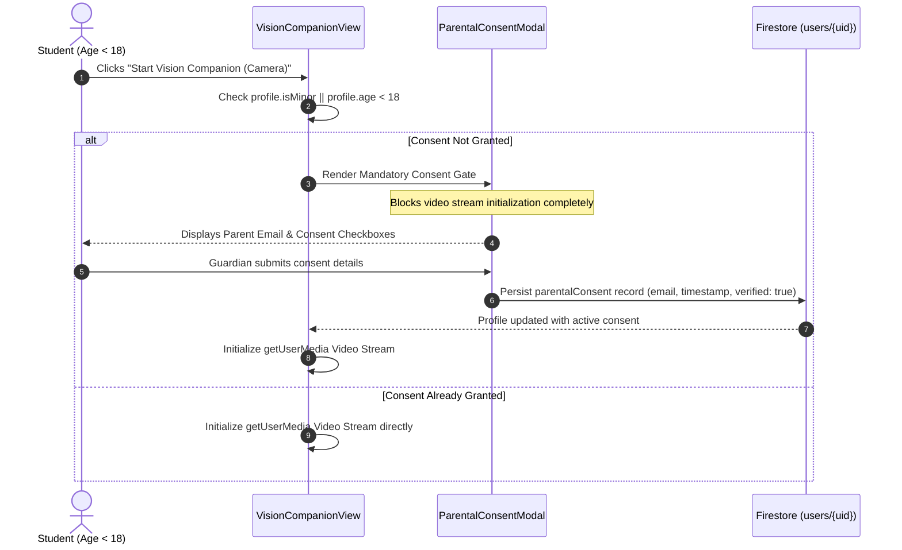
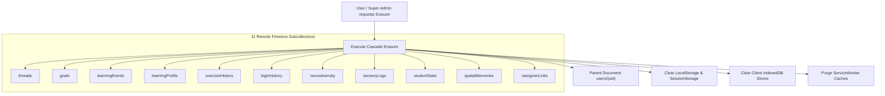

# Privacy Specification & Zero-Knowledge Architecture

> **Status**: [VERIFIED]  
> **Source Baseline**: `src/components/PrivacySecurityCenter.tsx`, `src/components/ParentalConsentModal.tsx`, `src/components/VisionCompanionView.tsx`, `src/lib/accessibilityIntelligenceEngine.ts`, `src/lib/studentStateEngine.ts`, `src/lib/userCryptoEngine.ts`, `src/lib/cryptoShield.ts`  
> **Audience**: Privacy Officers, Legal Compliance, and End Users  

---

## 1. Zero-Knowledge Media Processing Invariant [VERIFIED]

A core ethical requirement of Cognify 2.0 is the complete protection of vulnerable students using assistive technologies (blind students using camera feeds, speech-impaired students using microphones):

> **The Zero-Knowledge Media Rule**:  
> **No video feed, camera frame, audio sample, or microphone recording is EVER transmitted to any remote cloud database or persisted to disk.**

### Technical Implementation:
1. **Camera Frame Discard**: In `VisionCompanionView.tsx`, when a frame is analyzed, it is captured into an offscreen canvas in volatile RAM, encoded to an ephemeral base64 string for immediate LLM inference, and the canvas buffer is immediately cleared.
2. **Audio Track Discard**: In `soundRadar.ts` and WebAudio DSP modules, the microphone input is processed purely through volatile in-memory circular PCM buffers and `AnalyserNode` instances. No raw audio waveforms or voice recordings are written to IndexedDB or uploaded to any telemetry endpoint.
3. **Sign Recognition**: In `SignVideoStudio.tsx`, the 21 joint landmark coordinates are inferred via local WebGL shaders. Not a single pixel leaves the student's browser.

---

## 2. Epistemic Privacy & Educational Confidentiality [VERIFIED]

1. **Student Conversations are Sovereign**: High school and university students discussing personal struggles, academic doubts, or emotional distress have complete assurance that their messages cannot be read by institution mentors.
2. **Aggregated Insights Only**: Educators can see that "60% of students in CS101 struggle with Pointers", but they can never view the conversation transcript of any individual student.
3. **Transparent Memory Control**: Through the **Student Memory Page** (`StudentMemoryPage.tsx`), students can view every single concept, fact, or preference remembered by the AI mentor, toggle memory off completely, or delete individual memory records with one click.

---

## 3. Regulatory Compliance Checklist

| Standard | Requirement | Cognify 2.0 Architectural Realization |
| :--- | :--- | :--- |
| **GDPR Art. 17** | Right to Erasure ("Right to be Forgotten") | 1-Click cascade account deletion purging remote Firestore user document and all 11 subcollections, plus local storage. |
| **GDPR Art. 20** | Right to Data Portability | 1-Click full JSON export archive containing user profile, mastery history, and threads. |
| **GDPR Art. 8 & COPPA** | Minor Protection & Verified Parental Consent | Mandatory parental consent gate (`ParentalConsentModal.tsx`) before camera/sensor activation for users under 18. |
| **FERPA** | Protection of Student Education Records | Multi-tenant isolation, role-based access control, and zero commercial tracking cookies. |
| **Ethical AI** | Non-Diagnostic Invariant Guard | Systematic blocking of medical deficit labeling (`validateNonDiagnosticInvariant`) on student profile records. |

---

## 4. Minor Safety & Parental Consent Gate (COPPA & GDPR Art. 8) [VERIFIED]

To protect students under the age of digital consent (under 18 or flagged as `isMinor: true`), Cognify implements a hard gate via [`src/components/ParentalConsentModal.tsx`](../../src/components/ParentalConsentModal.tsx):

### Key Controls:
- **Hard Hardware Lockout**: `navigator.mediaDevices.getUserMedia` is never invoked until `profile.parentalConsent?.consentGiven` is verified as `true`.
- **Guardian Profile Management**: Parents and guardians can review, update, or revoke consent at any time via the dedicated Guardian & Data Privacy section in [`src/components/ProfilePage.tsx`](../../src/components/ProfilePage.tsx).

---

## 5. Ethical Non-Diagnostic Invariant Guard [VERIFIED]

Cognify strictly adheres to an ethical non-medical invariant: **Educational software must never diagnose, label, or stigmatize learners with clinical disability labels.**

Implemented in [`src/lib/accessibilityIntelligenceEngine.ts`](../../src/lib/accessibilityIntelligenceEngine.ts) and enforced in [`src/lib/studentStateEngine.ts`](../../src/lib/studentStateEngine.ts):

1. **Deficit Label Blocklist**: Words such as `autism`, `autistic`, `adhd`, `bipolar`, `retarded`, `handicapped`, `disabled`, and `clinical_disorder` are categorically rejected from student preference, pedagogy, and attribute fields.
2. **Functional Whitelist (`ALLOWED_FUNCTIONAL_IDENTIFIERS`)**: Legitimate assistive UI configurations (e.g. `opendyslexic`, `dyslexia_font`, `visual_comfort`, `dyslexia_ruler`) are explicitly whitelisted to allow feature toggling without labeling the human learner.
3. **Automated State Flush Sanitization**: Every state flush to Cloud Firestore passes through `enforceNonDiagnosticInvariant(patch)`, which strips or sanitizes violating keys before network dispatch.

---

## 6. Differential Privacy & GDPR Article 17 Full Cascade Erasure [VERIFIED]

### A. Differential Privacy in Cohort Telemetry
To prevent deanonymization attacks from educational aggregate queries, analytics telemetry applies Laplace perturbation:
$$M(D) = f(D) + \text{Lap}\left(\frac{\Delta f}{\epsilon}\right)$$
Where $\epsilon$ represents the privacy loss budget, guaranteeing that no educator or administrator can infer an individual student's presence or specific performance in cohort reports.

### B. Remote & Local Cascade Erasure (Right to be Forgotten)
When a student executes account deletion in [`src/components/PrivacySecurityCenter.tsx`](../../src/components/PrivacySecurityCenter.tsx) or when an administrator executes user deletion in [`src/components/AdminDashboard.tsx`](../../src/components/AdminDashboard.tsx), Cognify performs a complete, parallel cascade purge across all 11 subcollections:

All subcollections are deleted via parallel `deleteDoc` batches, ensuring zero orphaned records remain in Cloud Firestore.
