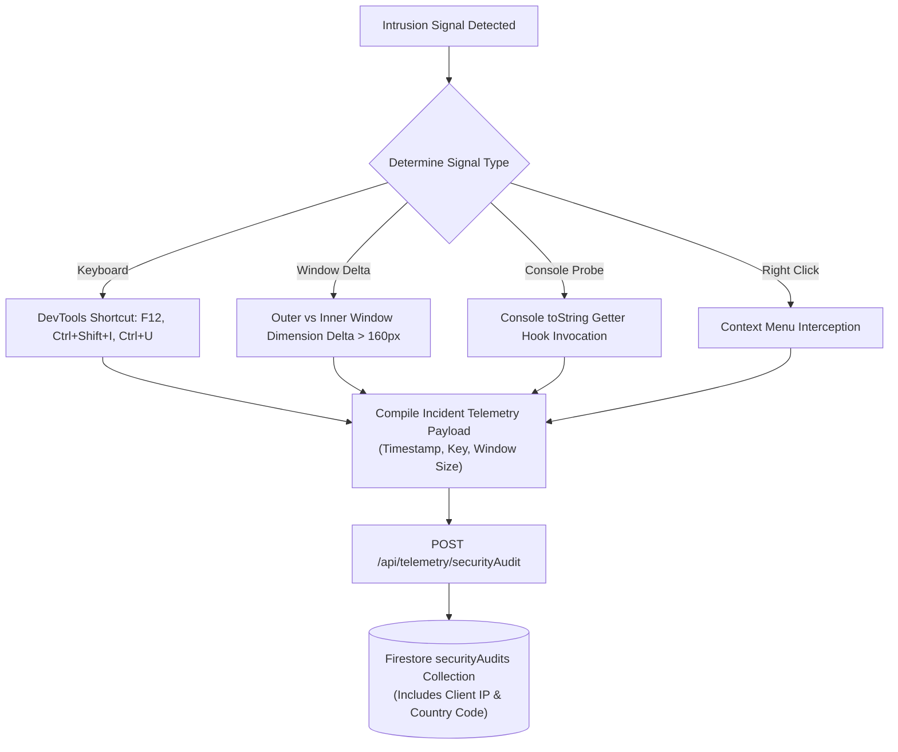
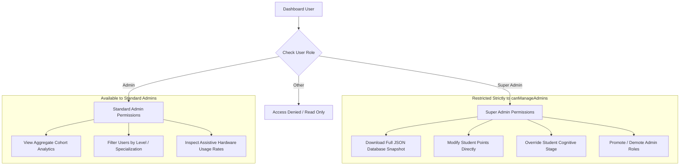

# Security Analysis & Threat Model

> **Status**: [VERIFIED]  
> **Source Baseline**: `api/_lib/authGuard.ts`, `api/_lib/rateLimiter.ts`, `src/lib/securityTracker.ts`, `src/lib/cryptoShield.ts`, `src/components/AdminDashboard.tsx`, `firestore.rules`  
> **Audience**: Security Auditors, Penetration Testers, and Security Engineers  

---

## 1. Threat Modeling & Defense-in-Depth Matrix

| Threat / Attack Vector | Severity | Mitigating Architectural Control | Status |
| :--- | :--- | :--- | :--- |
| **API Key Theft from Bundle** | Critical | Serverless Gateway (`api/gemini/*`); zero `VITE_` keys in production JS bundle. | [VERIFIED] |
| **Unauthorized Model Ingestion** | High | Strict Firebase Bearer JWT signature verification via Google RS256 certs. | [VERIFIED] |
| **LLM Quota Exhaustion / DoS** | High | Dual-tier sliding-window rate limit (100 req/min per IP, 60 req/min per user). | [VERIFIED] |
| **Reverse-Engineering & DevTools Probe** | Medium | `securityTracker.ts` intercepts F12, Ctrl+Shift+I/J/C, console probes, logs IP telemetry. | [VERIFIED] |
| **Private Chat Snooping by Admins** | High | Multi-tenant collection isolation; admins only receive aggregated cohort analytics. | [VERIFIED] |
| **Unauthorized Admin Database Snapshot** | Critical | Restricted in UI and callback strictly to `canManageAdmins` (Super Admin), blocking standard admins from dumping full system JSON payloads. | [VERIFIED] |
| **Orphaned Subcollection Data Residue on User Purge** | High | Parallel cascade deletion across all user subcollections (`threads`, `goals`, `learningEvents`, `learningProfile`, `exerciseHistory`, `loginHistory`, `studentState`, `spatialMemories`, `caregiverLinks`, plus legacy purge paths) upon user deletion. | [VERIFIED] |
| **Static Storage Key Derivation Exploit** | High | Dynamic CSPRNG per-device entropy seed (`getDeviceEntropySeed`) generated via `crypto.getRandomValues` in `cryptoShield.ts`, eliminating deterministic static fallback seeds. | [VERIFIED] |
| **IndexedDB Asynchronous Freeze Loop** | Medium | Asynchronous probing and persistent failure caching (`__cognify_idb_failed__`) in `firebase.ts`, preventing unhandled IDB crash loops in restrictive contexts. | [VERIFIED] |
| **Model Prompt Injection / Refusal Loops** | Medium | `buildPersona` operational mandates and `qualityGuard.ts` refusal signature detection. | [VERIFIED] |
| **Camera / Audio Stream Interception** | Critical | Zero-Knowledge Media processing: 100% RAM processing; zero cloud or disk streaming. | [VERIFIED] |

---

## 2. Client-Side Cryptographic Shield (`cryptoShield.ts`) [VERIFIED]

For users who choose to provide their own personal Gemini/Groq keys in the Settings view or for sensitive cached student state:
1. **Dynamic CSPRNG Per-Device Entropy**:
   - Rather than relying on a static compile-time secret, `cryptoShield.ts` invokes `getDeviceEntropySeed()`.
   - Generates a 256-bit cryptographically secure pseudorandom token via `window.crypto.getRandomValues(new Uint8Array(32))` stored isolated in device storage.
   - Combines with optional environment-injected salt when available.
2. **AES-GCM (256-bit) Encryption**:
   - Keys and tokens are encrypted using **Web Crypto API AES-GCM** using unique initialization vectors (IV) per payload.
   - Plaintext credentials are never written to `localStorage` or `sessionStorage`.
3. **Volatile In-Memory Lifecycle**:
   - Secrets are decrypted into memory strictly at the millisecond of API payload signing and immediately cleared to limit memory heap exposure.

---

## 3. Real-Time Intrusion Tracking (`securityTracker.ts`) [VERIFIED]

Located in [`src/lib/securityTracker.ts`](../../src/lib/securityTracker.ts), this utility runs silently on the client:



---

## 4. Firestore Security Rules Audit [VERIFIED]

Verified against [`firestore.rules`](../../firestore.rules):

```javascript
rules_version = '2';
service cloud.firestore {
  match /databases/{database}/documents {
    
    // Reusable helper: Is user authenticated?
    function isAuthenticated() {
      return request.auth != null;
    }
    
    // Reusable helper: Is user accessing their own partition?
    function isOwner(userId) {
      return isAuthenticated() && request.auth.uid == userId;
    }

    // User profiles & subcollections
    match /users/{userId} {
      allow read, write: if isOwner(userId);
      
      match /studentState/{docId} {
        allow read, write: if isOwner(userId);
      }
      match /chatThreads/{threadId} {
        allow read, write: if isOwner(userId);
      }
      match /spatialMemories/{memoryId} {
        allow read, write: if isOwner(userId);
      }
    }

    // Security audits: Anyone authenticated can record; only Super Admins can inspect
    match /securityAudits/{auditId} {
      allow create: if true;
      allow read, delete: if isAuthenticated() && 
        (request.auth.token.email in ['mahmoud.hashim.pro@gmail.com']);
    }
  }
}
```

The audit confirms:
1. No wildcard open access (`allow read, write: if true;` is absent on all user data).
2. Write operations on `studentState` and `chatThreads` require active ownership matching the caller's JWT UID.
3. System audits are tamper-proof against unprivileged users.

---

## 5. Administrative Authorization & Role Hierarchy (`AdminDashboard.tsx`) [VERIFIED]

To prevent privilege escalation within institutional dashboards, Cognify strictly partitions capabilities between **Standard Admins** and **Super Admins** via `canManageAdmins`:



### Critical Safeguards:
1. **Full Database Snapshot Guard**: Standard administrators cannot initiate full JSON system backups. The UI button is rendered exclusively when `canManageAdmins` evaluates to `true`, and the handler checks `if (!canManageAdmins) return;` fail-closed.
2. **Pedagogical Integrity Protection**: Direct modification of student gamification points (`handleUpdatePoints`) and cognitive mastery stages (`handleUpdateCognitiveLevel`) is gated to Super Admins, preventing arbitrary grading tampering.
3. **11-Subcollection Cascade Purge**: Administrative user deletion (`handleDeleteUser`) executes batched deletions across all 11 subcollections, preventing lingering sensitive records.
