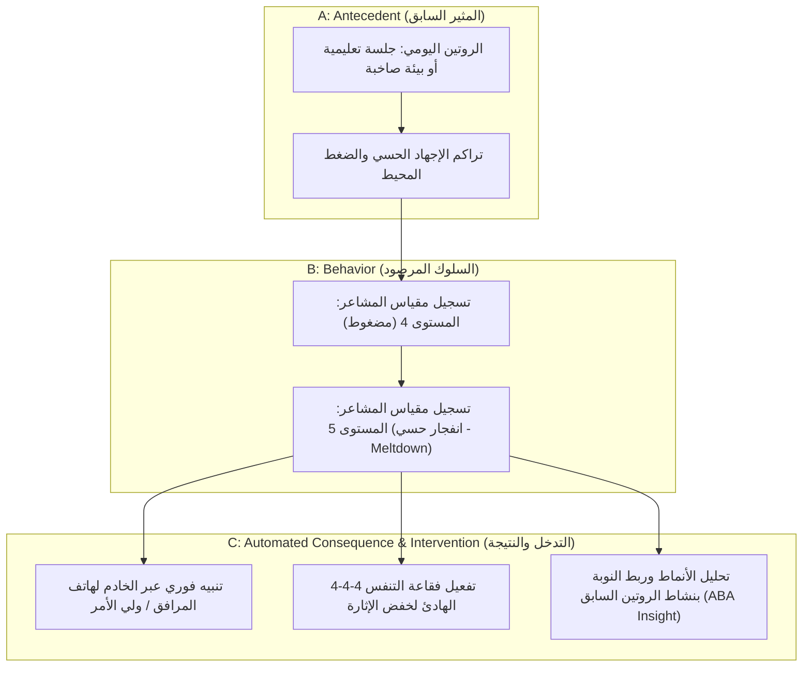

# Cognify Neurodiversity & Autism: Clinical ABA & SLP Validation Protocol
**Document Version:** 1.0.0  
**Target Stakeholders:** Board Certified Behavior Analysts (BCBA), Speech-Language Pathologists (SLP), Occupational Therapists (OT), Special Education Centers.  
**Classification:** Clinical Governance & Verification Specification

---

## 1. Executive Summary & Clinical Framework

Cognify's **Neurodiversity & Autism Suite** bridges Assistive Augmentative & Alternative Communication (AAC), behavioral predictability, and automated caregiver de-escalation for neurodivergent learners, particularly those diagnosed with Autism Spectrum Disorder (ASD), Sensory Processing Sensitivity (SPS), and ADHD.

To transition from an engineering implementation to a **clinically certified pediatric tool**, this protocol specifies the verification standards required under:
- **Applied Behavior Analysis (ABA)** Antecedent-Behavior-Consequence (ABC) methodology.
- **Picture Exchange Communication System (PECS)** phases I through IV standards (Frost & Bondy).
- **Sensory Integration & Environmental Regulation Framework** (Ayres Sensory Integration®).

---

## 2. PECS Communication Cards: Clinical Review Matrix

### 2.1 Lexical & Operant Structure Evaluation
In ABA behavioral verbal analysis (B.F. Skinner), AAC phrases must fulfill specific operants:
- **Mands (Demands / Requests):** Primary focus for Phase I–III learners (e.g., requesting water, food, bathroom, or breaks).
- **Tacts (Labels / Identification):** Phase IV learners labeling emotions or environmental sensations (e.g., "Too loud", "In pain").
- **Intraverbals / Social Operants:** Social bids for calming touch (e.g., "Need a hug", "Play game").

| Card ID | Arabic Label | Spoken Phrase (Mands/Tacts) | Category | Operant Type | Clinical Review Standard |
| :--- | :--- | :--- | :--- | :--- | :--- |
| `pecs-1` | مية (ماء) | "أنا عايز أشرب مية لو سمحت." | Food & Drink | Mand (Primary) | Direct reinforcer access; high-frequency prompt |
| `pecs-2` | أكل / جوعان | "أنا جوعان وعايز آكل وجبة خفيفة." | Food & Drink | Mand (Primary) | Satiation / hunger cue; reduces frustration |
| `pecs-3` | حمام | "عايز أروح الحمام لو سمحت." | Routine | Mand (Essential) | Autonomy in personal hygiene routines |
| `pecs-4` | فرحان / مبسوط | "أنا حاسس بفرح ومبسوط." | Feelings | Tact (Emotional) | Positive reinforcement feedback loop |
| `pecs-5` | زعلان / مضايق | "أنا زعلان وحاسس بضيق." | Feelings | Tact (Emotional) | Early frustration signaling before escalations |
| `pecs-6` | صوت عالي / إزعاج | "الصوت عالي ومزعج، محتاج هدوء." | Feelings / Sensory | Tact + Mand | Triggers acoustic de-escalation & noise reduction |
| `pecs-7` | تعبان / عايز أنام | "أنا تعبان ومحتاج أرتاح شوية." | Routine / Sensory | Mand (Somatic) | Sleep / rest request; signals sensory exhaustion |
| `pecs-8` | عايز ألعب | "عايز ألعب بلعبتي المفضلة." | Play / Joy | Mand (Preferred item) | Motivating operation (MO) for social engagement |
| `pecs-9` | أنا محتاج حضن | "محتاج حضن عشان أهدى." | Feelings / Deep Pressure | Mand (Proprioceptive) | Deep pressure therapy bid for nervous system regulation |
| `pecs-10` | عايز مساعدة | "ممكن تساعدني في دي لو سمحت؟" | Help / Social | Mand (Universal) | Prevents avoidance behaviors during difficult tasks |
| `pecs-11` | ألم / في حاجة بتوجعني | "عندي ألم وفي حاجة بتوجعني." | Medical / Somatic | Tact (Pain assessment) | Urgent health identification; links to triage |
| `pecs-12` | عايز أتمشى | "عايز أخرج أتمشى في الهواء." | Play / Gross Motor | Mand (Vestibular) | Movement break; addresses vestibular seeking |

---

## 3. Antecedent-Behavior-Consequence (ABC) Meltdown Pipeline

Cognify's automated sensory monitoring translates clinical ABC recording into automated real-time alerts:

### 3.1 Non-Interactive Dispatch Reliability Standard
- **The Core Rule:** During an acute meltdown, the child exhibits autonomic nervous system fight-or-flight activation. Under no circumstances should the system require the distressed learner to navigate outside the application or press send on external messaging apps.
- **Fail-Closed Dispatch:** Dispatch requests flow directly via `POST /api/emergency/dispatch` with mandatory Firebase Bearer authentication, per-UID rate limiting (5 req/min), E.164 sanitization, and automated audit logging.

---

## 4. Routine Predictability & Clinical Schedule Correlation

Children with ASD often experience heightened anxiety when daily transitions are unpredictable. Cognify's **Visual Predictability Schedule** provides:
1. **Time-Blocked Milestones:** Visual cues with distinct pictograms (`🪥`, `🥣`, `📚`, `🍲`, `🎨`, `🌙`).
2. **Persistent Checkmarks:** Eliminates ambiguity regarding task completion.
3. **Automated Schedule Correlation Engine:**
   $$\text{Correlation Rate} = \frac{\text{Meltdowns within 0--3 hrs after Task } T}{\text{Total Recorded Meltdowns}} \times 100$$
   - When a specific activity correlates with $\ge 50\%$ of sensory overload episodes, the system automatically surfaces an ABA clinical recommendation:
     > *"67% of sensory overload episodes occurred after: 'Learning & Reading Session'. ABA & OT Clinical Recommendation: Schedule a 10-minute quiet sensory break and reduce ambient stimulation immediately following this activity."*

---

## 5. Formal Clinical Partnership Protocol (4-Week Pilot Setup)

| Week | Phase | Objectives | Evaluator Role | Success Metric |
| :---: | :--- | :--- | :--- | :--- |
| **Week 1** | **Lexical Adaptation** | Speech pathologist reviews PECS phrasing for dialectical congruence (MSA vs. Egyptian Ammiya). | SLP Specialist | 100% agreement on card phrasing & voice clarity. |
| **Week 2** | **Baseline ABC Logging** | Observational recording of 10 autistic students using the visual routine schedule and emotion check-in. | BCBA / ABA Therapist | $\ge 95\%$ adherence to daily routine tracking. |
| **Week 3** | **Meltdown Response Verification** | Live simulation of Level 5 sensory alerts. Verification of caregiver SMS/webhook delivery latency. | Caregiver & QA Lead | Alert delivered to caregiver device in $< 2.5\text{ seconds}$. |
| **Week 4** | **Clinical Correlation Review** | ABA team reviews the automated pattern analysis report in CaregiverHub to adapt student therapy plans. | Clinical Board | Measurable reduction in transition anxiety episodes. |

---

## 6. Ethics & Child Protection Standards
1. **Zero-PII Storage:** Sensory logs track intensity levels, relative time windows, and coping strategies; no audio streams or biometric facial feeds are stored.
2. **Caregiver Granular Consent:** Data sharing requires explicit student profile linking through `listenPendingCaregiverRequests` and `approveCaregiverLinkRequest`.
3. **Fail-Closed Safety:** Direct dialing fallbacks are retained if network or cloud dispatch endpoints encounter connectivity interruptions.
