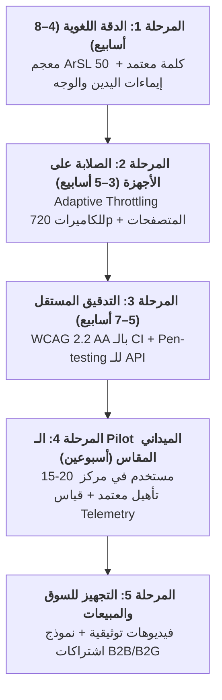

# 🗺️ Cognify: Master Go-To-Market & Institutional Launch Roadmap (2026–2027)

**Product**: Cognify Production Platform  
**Target Accreditation**: Egyptian Deaf Care Society, Ministry of Social Solidarity, Universities, and Enterprise Inclusive CSR Partnerships.

---

## 📌 Strategic Overview & Execution Phases

---

## 🎯 Phase Breakdown & Success Criteria

### 1. 🤟 المرحلة 1: الدقة اللغوية (Linguistic Precision & ArSL Integration)
* **Duration**: 4 – 8 Weeks
* **Objective**: Transition from phonetic fingerspelling to genuine lexical Arabic & Egyptian Sign Language (ArSL).
* **Key Deliverables**:
  - Official partnership outreach with the Egyptian Deaf Care Society and Special Education Departments (Helwan / Al-Azhar Universities).
  - Production integration of the initial **50 Foundational Seed Signs** (Greetings, Academic, Emergency, Numbers).
  - Two-handed 3D Avatar gestural articulation + eyebrow raise for question markers (`?`).
* **Success Metric**: $\ge 80\%$ independent comprehension rate among native deaf test users on the 50 foundational signs without caption aids.

---

### 2. 🦾 المرحلة 2: الصلابة على الأجهزة الواقعية (Real-Device Performance & Robustness)
* **Duration**: 3 – 5 Weeks (Parallel)
* **Objective**: Ensure seamless operation on budget hardware (2-year-old laptops, 720p webcams, midrange mobile phones).
* **Key Deliverables**:
  - Dynamic **Graceful Degradation Engine**: Automatically drops canvas resolution or skips frames if camera pipeline falls below 20 FPS.
  - Cross-browser parity across Chromium, WebKit (iOS Safari), and Firefox (speech synthesis/recognition fallbacks).
* **Success Metric**: Continuous, stable head-pointer and eye-blink tracking on standard 720p webcams with CPU usage $< 35\%$.

---

### 3. 🛡️ المرحلة 3: التدقيق المستقل ومعايير WCAG (Independent Audit & Security)
* **Duration**: 5 – 7 Weeks
* **Objective**: Eliminate all critical security, privacy, and accessibility vulnerabilities.
* **Key Deliverables**:
  - **Automated WCAG 2.2 AA CI Assertion Gate**: Automated regression tests on color contrast, focus rings, ARIA landmarks, and keyboard traps.
  - **Penetration Testing**: Independent validation of rate limiters, auth guards, and non-PII Firestore audit logs on `/api/emergency/dispatch`.
  - Usability testing sessions with 5–10 real users across Visual, Deaf, Motor, and Neurodiversity profiles.
* **Success Metric**: 0 Critical Security Vulnerabilities + Official WCAG 2.2 AA Compliance Audit Certificate attached to the Proof Pack.

---

### 4. 🔬 المرحلة 4: الـ Pilot الميداني المقاس (Empirical Field Pilot)
* **Duration**: 2 Weeks (14 Days)
* **Objective**: Generate empirical, peer-verifiable usage data from an active institution.
* **Cohort**: 15–20 real students across 1 disability center or inclusive university faculty.
* **Empirical Telemetry Tracked**:
  1. **SOS Dispatch Delivery Rate**: Verified delivery percentage via Multi-Channel fallback.
  2. **Hands-Free Motor Autonomy**: Dwell clicks and eye-blink typing efficiency.
  3. **Visual Reader Accuracy**: Egyptian Pound banknote recognition success rate.
* **Success Metric**: Documented, verifiable incident and interaction logs demonstrating $> 90\%$ task fulfillment.

---

### 5. 💼 المرحلة 5: التجهيز للسوق والمبيعات (Market Readiness & Packaging)
* **Duration**: Parallel with Phases 3 & 4
* **Objective**: Deliver a cohesive B2B/B2G sales package for institutional decision-makers.
* **Deliverables**:
  - 2-Minute High-Impact Walkthrough Videos for each of the 4 assistive suites.
  - **The Cognify Proof Pack Dossier**: Official audit sheet + WCAG report + Telemetry certificate.
  - Institutional SaaS Tier Pricing Model (Annual per-seat licenses for schools, universities, and rehabilitation centers).

---
**Maintained by**: The Cognify Engineering Team  
**Repository**: `github.com/Mahmoud-Hashim-pro/cognify-production`
