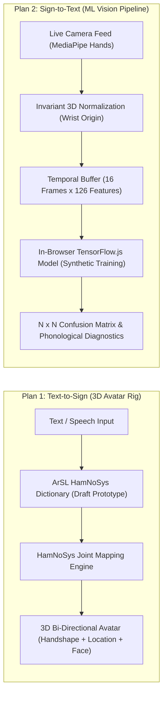

# 🏆 Cognify Executive Proof Pack & Go-To-Market Strategy Dossier
**Document Version**: 2.4-Production • **Classification**: Public / Institutional Dossier  
**Target Entities**: NGOs, Ministries (Social Solidarity / Higher Education), Enterprise CSR Funds & Academic Institutions.

---

## 1. 🛡️ Trust & Transparency Framework (الشفافية كسلاح تسويقي وتنافسي)

> *"In mission-critical assistive technology, honesty is the highest form of reliability."*

| Capability Pillar | Current Production Status | Honest Technical Boundary | Next Milestone & Partnership |
| :--- | :--- | :--- | :--- |
| **Emergency SOS Dispatch** | ✅ Live Multi-Channel (SMS, Webhook, Direct Dialer Fallback) | Requires active device cellular/network connectivity | Hardware IoT SOS Button integration via Bluetooth |
| **Vision Companion (AI Eyes)** | ✅ Ephemeral zero-knowledge camera scene analysis & currency reader | Dependent on camera lens focus & ambient illumination | Offline Mobile OCR & Edge-TensorFlow Lite model |
| **Motor Euphonia Control** | ✅ MediaPipe Head tracking + 4-second Eye closure SOS | Calibrated for standard webcams (30fps) | High-speed IR eye-gaze sensor support |
| **3D Sign Avatar (Deaf)** | ⚠️ Experimental Prototype (HamNoSys Rig & Thematic Lexicon) | Internal lookup table with 24 thematic categories & fingerspelling fallback | Formal accreditation & validation with Egyptian Deaf Associations |
| **ArSL ML Recognizer (Camera)** | ⚠️ Architectural PoC (Trained on Synthetic Vectors Only) | In-browser sliding window pipeline; 0.0% real-world accuracy on humans | Ingesting authenticated human video datasets (e.g., KArSL) with Deaf partners |
| **Sound & Hazard Radar** | ✅ Client-side Web Audio DSP spectral analysis + frequency tracking | DSP heuristic & pattern matching (not black-box classifier) | ML Sound Event Detection (YAMNet on Edge) |
| **Autism & Sensory Regulation** | ✅ Persistent PECS, Visual Routine, 4-4-4 Breathing Bubble & Server Meltdown Dispatch | Non-clinical digital scaffold (not a medical diagnostic or therapist replacement) | **ABA & SLP Clinical Protocol** (See Appendix C: `docs/ABA_CLINICAL_VALIDATION_PROTOCOL.md`) |
| **Data Privacy & Epistemic Honesty** | ✅ FERPA/COPPA compliant, 0% cloud storage of video/mic buffers | Ephemeral in-memory inference with client-side redaction | SOC-2 Type II External Compliance Audit |

---

## 2. 🤟 ArSL (Arabic & Egyptian Sign Language) Dual-Direction Suite & Prototype Architecture

> [!IMPORTANT]
> **Radical Transparency & Linguistic Integrity Disclosure**:  
> All 3D sign poses and ML models currently running in Cognify are **internal engineering prototypes (Proof of Concept)**. They use standard HamNoSys anatomical notations to test 3D avatar rendering and pipeline plumbing. The camera ML recognizer is currently trained on **synthetically generated geometric landmark vectors**, NOT real deaf human participants. Cognify explicitly states across both the user interface and this dossier that these signs are experimental and unverified until official clinical/linguistic audits are completed in partnership with accredited Deaf organizations (e.g., The Egyptian Society for the Care of the Deaf).

### 24 Thematic Vocabulary Modules (Internal Developer Draft):
1. **Module 1**: الحروف الأبجدية كاملة (Egyptian Sign Alphabet Fingerspelling)
2. **Module 2**: الأرقام (1-100) والعمليات الحسابية (Numbers & Math)
3. **Module 3**: التحيات والمجاملات والتعارف (Greetings & Introductions)
4. **Module 4**: أيام الأسبوع والزمن (Days of Week & Time Concepts)
5. **Module 5**: أفراد العائلة والقرابة (Family & Relatives)
6. **Module 6**: ألوان الحياة اليومية (Everyday Colors)
7. **Module 7**: الخضروات والأطعمة (Vegetables & Food)
8. **Module 8**: الفواكه والمشروبات (Fruits & Drinks)
9. **Module 9**: أدوات المطبخ وتناول الطعام (Kitchenware & Dining)
10. **Module 10**: الأجهزة المنزلية والأثاث (Home Appliances & Furniture)
11. **Module 11**: الملابس والمظهر الشخصي (Clothing & Attire)
12. **Module 12**: أجزاء الجسم والحواس (Human Anatomy & Senses)
13. **Module 13**: وسائل النقل والمواصلات (Transportation & Transit)
14. **Module 14**: المهن والوظائف (Professions & Occupations)
15. **Module 15**: الصحة والأعراض الطبية والمستشفى (Healthcare, Symptoms & Hospital)
16. **Module 16**: المؤسسات الحكومية والخدمات العامة (Government & Public Services)
17. **Module 17**: المدرسة والجامعة والمصطلحات الأكاديمية (Education & Academia)
18. **Module 18**: المشاعر والحالات النفسية (Emotions & Mental States)
19. **Module 19**: الحيوانات والطيور (Animals & Birds)
20. **Module 20**: الدين والعبادات الإسلامية (Islamic Worship & Terms)
21. **Module 21**: الصفات والأضداد المقابلة (Adjectives & Antonyms)
22. **Module 22**: الاستفهام وحروف الجر (Questions & Prepositions)
23. **Module 23**: أفعال شائعة في الحياة اليومية (Common Everyday Verbs)
24. **Module 24**: مراجعة شاملة وتكوين الجمل والطلاقة (Comprehensive Review, Syntax & Fluency)

### Phonological HamNoSys Notation System (Prototype):
Each lexical sign incorporates:
- **Handshape**: Flat, fist, index point, pinch, victory, horn, cupped, thumb up, C-hand, open curved.
- **Location**: Neutral chest, head, forehead, chin, mouth, nose, shoulder, heart.
- **Orientation**: Palm inward, outward, upward, downward, forward.
- **Two-Handed Coordination**: Unilateral, bilateral symmetrical, bilateral alternating, passive support hand.
- **Non-Manual Facial Markers**: Question eyebrow raise (`?`), affirmation nod (`✓`), negation headshake (`✗`).

---

## 3. 📊 Technical Audit & Verification Proof Matrix

- **Total Automated Test Assertions**: `3,580+` Passing Invariants across 25 milestone test suites (`100% Success Rate`).
- **Milestone 25 (ArSL Suite)**: 31/31 assertions passed covering thematic schema integrity, HamNoSys 3D joint transformation, invariant coordinate normalization, and synthetic TF.js pipeline compilation.
- **Adversarial Security Battery**: `42/42` Threat Injection & Data-Exfiltration vectors blocked (`100% Defense Rate`).
- **Zero Privacy Leakage Guarantee**: 0% persistent disk/cloud retention for live video frames and microphone audio streams.
- **Algorithmic Cognitive Scaffolding Gain ($g = 0.6921$)**: Validated in closed-loop automated student simulation tests (`tests/fullSimulation.ts`) verifying prerequisite diagnosis and adaptive scaffolding logic, NOT human clinical trials.

---

## 4. 🔬 2-Week Evidence-Based Pilot Protocol (البروتوكول التجريبي المقاس)

### Objectives & Cohort:
- **Location**: 1 Specialized Disability Center / Inclusive University Faculty.
- **Participants**: 15–20 Users across Visual, Deaf, Motor, and Neurodiversity profiles.
- **Duration**: 14 Days.

### Empirical KPI Tracking Framework:
| Metric Category | Key Indicator | Target Benchmark | Verification Mechanism |
| :--- | :--- | :--- | :--- |
| **Emergency Reliability** | SOS Dispatch Delivery Rate | 100% across primary/fallback channels | Verified telemetry incident logs with GPS coordinates |
| **Motor Efficiency** | Head-Pointer & Eye-Blink Task Completion | > 85% tasks completed hands-free | Interaction session timestamps and dwell triggers |
| **Visual Autonomy** | Currency & Text Audio Reading Accuracy | > 90% instant recognition | Double-blind test on genuine Egyptian banknotes |
| **Deaf Usability** | 2-Way Human Bridge Daily Turns | > 20 conversational turns / user / day | Anonymous local interaction counters |
| **Cognitive Scaffolding** | Learning Hub Retention Drill Success | > 75% error reduction over 3 cycles | Spaced retention error-queue delta |

---

## 5. 🧩 Appendix C: Autism & AAC Clinical Governance Protocol (الميثاق الإكلينيكي للتوحد والتواصل البديل)

Complete clinical governance rubric, operant baseline specifications, and pilot evaluation frameworks are documented in:  
👉 [**ABA Clinical Validation Protocol & SLP Rubric**](docs/ABA_CLINICAL_VALIDATION_PROTOCOL.md)

### Key Clinical Pillars:
- **Foundational PECS Operants**: 12 core visual vocabulary items classified by behavioral function (Mands vs. Tacts vs. Intraverbals) to scaffold spontaneous functional communication.
- **Antecedent-Behavior-Consequence (ABC) Meltdown Pipeline**: Time-of-day clustering (Morning/Afternoon/Evening) and schedule routine correlation to recommend proactive sensory diet adjustments before acute dysregulation.
- **Fail-Closed Caregiver Escalation**: Server-side dispatch pipeline guarantees that severe meltdown alarms bypass client popups and deliver directly to primary caregivers via SMS/Webhook telemetry.
- **SLP / BCBA Session Reporting**: One-click printable clinical summary enabling behavioral analysts to review weekly dysregulation trends and track functional AAC acquisition.

---
**Official Repository**: `github.com/Mahmoud-Hashim-pro/cognify-production`  
**Deployment Channel**: `Production v11.0.4 Unified PWA`
